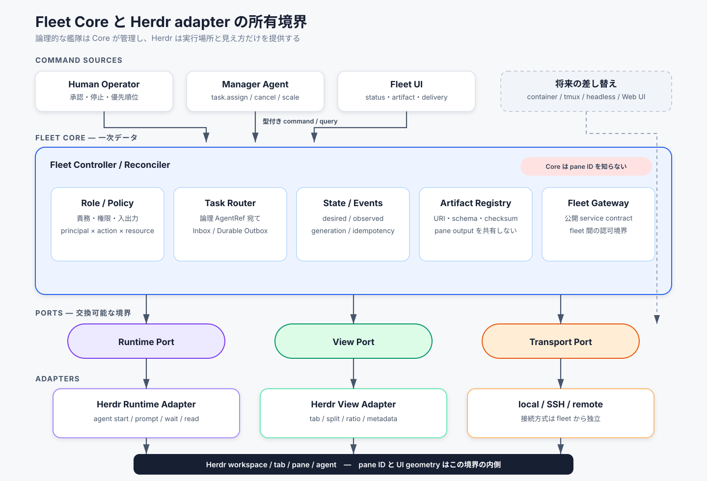
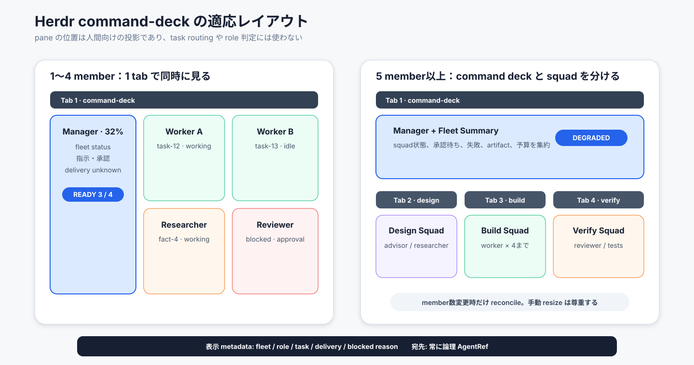

# Fleet Core と Herdr adapter を分離してエージェント艦隊を作る

> 型: デザインドック / RFC ／ 読み手: harness plugin、Herdr、herdr-remote の設計・実装を判断する人

- **状態**: レビュー中
- **作成者**: Codex（統合案）、fable5役の独立サブエージェント（独立案）
- **レビュアー**: リポジトリ所有者
- **期限**: 未定

## 要約

**課題**: role、fleet、pane 配置、指示配送、fleet 間連携が同じ層へ入ると、Herdr の都合が艦隊の業務ルールになる。pane の移動や再生成だけで宛先が壊れ、別 runtime も選べない。

**推奨案**: `Fleet Core` を正本にする。role と権限、fleet の desired state、task、成果物、イベントを Core が持つ。Herdr は Runtime Adapter と View Adapter に分ける。

**求める判断**: `agent-roles-plugins` と `agent-fleet-plugins` を分けるか。MVP を local Herdr、manager 1、worker 2、reviewer 1へ絞るか。この2点を決めてほしい。

## 背景と課題

**現行 v2 には、複数エージェントを艦隊として編成し、指揮する plugin がない。** 旧モノレポには5つの role と関係性を定義する `agent-roles` がある。ただし、この plugin はエージェントを起動しない。

**herdr-remote は監視・手動操作の PoC であり、艦隊の正本には向かない。** 現行実装は host、workspace、tab、pane を直接扱う。role、論理 Agent ID、task、権限、fleet はモデル化していない。

[herdr-remote の設計](../../../herdr-remote/DESIGN.md) は「**非目標: 疎結合・堅牢なアーキテクチャ。**」と明記する。この制約を尊重し、Fleet Core を herdr-remote へ埋め込まない。

**Herdr 0.8 系は adapter の実装に必要な primitive を既に持つ。** `workspace create`、`pane split`、`agent start`、`agent prompt`、`agent wait`、`report-metadata` を利用できる。

[Herdr Agent automation](https://herdr.dev/docs/agent-automation/) は “**agent start therefore requires an existing shell pane and never creates, splits, or moves layout.**” と説明する。この境界を Runtime Port と View Port の分離へ反映する。

## ゴール / 非ゴール

- ゴール: role の責務と権限を pane や agent model から独立して定義できる
- ゴール: manager が論理 Agent ID へ task を割り当て、現在の pane へ配送できる
- ゴール: pane の移動・再作成後も、同じ論理 Agent ID へ指示できる
- ゴール: 人間が Herdr UI で manager、member、状態、割当を確認できる
- ゴール: fleet 内と fleet 間の連携を別契約として扱える
- ゴール: 将来、Runtime と View を Herdr 以外へ差し替えられる
- **非ゴール**: 初期版で分散合意、汎用 message broker、複数 controller を作る
- **非ゴール**: agent の自然言語 prompt を権限制御として扱う
- **非ゴール**: pane の位置や隣接関係を指示の宛先に使う
- **非ゴール**: herdr-remote を fleet controller へ作り替える

## 提案

### 一言でいうと

> **Fleet Core は論理的な艦隊を管理し、Herdr は実行場所と見え方だけを提供する。**

### 所有境界

**5つの関心を別の所有者へ置く。** role は Policy、fleet は Controller、連携は Collaboration、実行は Runtime Adapter、見え方は View Adapter が持つ。



*図1: Fleet Core は pane ID を知らない。Herdr 固有値は adapter 内の Runtime Binding と View Placement に閉じる。*

| 関心 | 正本 | Herdr 依存 | 主な責務 |
|---|---|---:|---|
| role と権限 | Role Registry / Policy Engine | なし | 入出力、許可操作、禁止操作、停止条件 |
| fleet 編成 | Fleet Spec / Controller | なし | desired state、replica、lifecycle、reconcile |
| task と成果物 | Collaboration Bus / Artifact Registry | なし | assignment、進捗、成果物参照、レビュー |
| agent の実行 | Runtime Adapter | あり | pane 確保、agent 起動、prompt、状態観測 |
| pane の見え方 | View Adapter | あり | tab、split、比率、metadata、drift |
| host への到達 | Transport Adapter | 任意 | local socket、SSH、remote API |
| fleet 間連携 | Fleet Gateway | なし | 公開 capability、入力・出力契約、認可 |

### 同一視しない5つのオブジェクト

**role、agent、task、実行場所、画面上の位置を別オブジェクトにする。** この分離が pane 再配置と runtime 差し替えを可能にする。

| オブジェクト | 意味 | 例 |
|---|---|---|
| `RoleDefinition` | 静的な責務・権限・入出力契約 | reviewer は反証を返す |
| `AgentInstance` | role を割り当てられた論理的な実行主体 | `agt_reviewer_1` |
| `TaskAssignment` | 期間を限定した仕事と完了条件 | PR差分を反証する |
| `RuntimeBinding` | agent が現在動く実行場所 | adapter、host、pane、generation |
| `ViewPlacement` | UI 上の表示位置と表現 | command-deck の右上 |

`pane_id` は `RuntimeBinding` だけが持つ。manager、task、role、fleet 間契約へ `pane_id` を出さない。

### Fleet Spec

**Fleet Spec は論理構成だけを宣言する。** pane の方向、分割比率、tab 名は View Profile へ置く。

```yaml
apiVersion: fleet.harness/v1
kind: Fleet
metadata:
  name: product-change-alpha
spec:
  objective: 機能Aを設計・実装・検証する
  roles:
    - {roleRef: manager@1, replicas: 1}
    - {roleRef: worker@1, replicas: 2}
    - {roleRef: reviewer@1, replicas: 1}
  coordination:
    pattern: manager-worker
  policies:
    failure: replace-once
    humanApproval: [destructive, external-write]
  runtimeRef: local-herdr
  viewRef: herdr-command-deck
```

`runtimeRef` と `viewRef` は別にする。agent を Herdr で動かし、Web dashboard だけで表示する構成も許す。

### role と Policy

**role は prompt template ではなく、検査可能な契約である。** Policy Engine は command 受付時に `principal × action × resource` を検査する。

```yaml
id: reviewer
version: 1
produces: refutation
inputs: [review-request, artifact-ref]
outputs: [review-report]
capabilities:
  allow: [artifact.read, review.publish, task.progress]
  deny: [artifact.modify, fleet.scale, fleet.terminate]
limits:
  maxConcurrentTasks: 1
escalation:
  blockedTo: manager
```

manager も無制限にしない。自 fleet の assign、cancel、scale、drain は許可する。破壊操作、外部送信、予算超過は human approval を要求する。

### 指示配送

**manager は pane へ文字列を直送せず、論理宛先へ型付き command を発行する。** Fleet Core が権限を検査し、Outbox が現在の Runtime Binding を解決する。

```text
Manager
  → AssignTask(target=agent:agt_worker_2)
  → Policy check
  → Durable Outbox
  → Runtime Binding 解決
  → Herdr Runtime Adapter
  → herdr agent prompt <live-agent> <rendered-command>
  → delivery observation / acknowledgement
```

宛先は `agent:<id>`、`role:<id>`、`topic:<name>`、`fleet:<id>/service:<name>` に限定する。pane ID、tab ID、画面座標を宛先にしない。

配送状態は `pending → submitting → delivered → acknowledged` とする。送信結果を確定できない場合は `unknown` へ進め、自動再送しない。

### Command と Event

**command は要求、event は確定した事実として分ける。** 全 envelope に correlation、causation、idempotency、generation を含める。

```json
{
  "api_version": "fleet.harness/v1",
  "id": "cmd_01...",
  "kind": "task.assign",
  "fleet_id": "flt_01...",
  "sender": {"type": "agent", "id": "agt_manager"},
  "target": {"type": "agent", "id": "agt_worker_2"},
  "correlation_id": "task_01...",
  "idempotency_key": "task_01...:generation-3",
  "expected_generation": 3,
  "payload": {
    "objective": "機能Aを実装する",
    "acceptance_criteria": ["検証commandが成功する"],
    "inputs": [{"artifact_ref": "artifact://spec/sha256:..."}]
  }
}
```

主要 command は `fleet.create`、`fleet.scale`、`fleet.drain`、`agent.replace`、`task.assign`、`task.cancel`、`artifact.publish`、`approval.respond` である。

主要 event は `FleetReady`、`FleetDegraded`、`AgentBound`、`RuntimeBindingLost`、`TaskAccepted`、`TaskCompleted`、`AgentBlocked`、`CommandDeliveryUnknown`、`LayoutDriftDetected` である。

初期実装は SQLite に current state、append-only event ledger、inbox、outbox を持つ。完全な event sourcing は採らない。

### lifecycle

**fleet の Ready は、必要な role replica が利用可能な状態を指す。** 全 agent が idle であることは要求しない。

```text
Fleet:   Draft → Validated → Provisioning → Ready → Draining → Terminated
                                  └→ Failed   ├→ Degraded → Ready
                                               └→ Paused → Ready

Agent:   Requested → Provisioning → Ready → Busy → Ready
                         └→ Failed      ├→ Blocked → Busy / Ready
                                        └→ Restarting → Ready

Task:    Queued → Assigned → Accepted → Running → Succeeded
                                ├→ Rejected      ├→ Blocked → Running
                                                  ├→ Failed
                                                  └→ Canceled
```

Runtime Binding は `Unbound → Allocating → Bound → Lost → Rebinding → Bound` と進む。pane が消えても AgentInstance は同一性を保つ。

### Herdr Runtime Adapter

**Runtime Port は agent の実行操作だけを公開する。** View の geometry 操作を混ぜない。

| Runtime Port | Herdr 0.8 系への変換 |
|---|---|
| `AllocateRuntime` | workspace、tab、pane の存在を確認する |
| `StartAgent` | `herdr agent start` |
| `SubmitCommand` | `herdr agent prompt` |
| `ObserveAgent` | `agent get`、`agent list`、`agent wait` |
| `ReadOutput` | `agent read` |
| `StopAgent` | graceful stop。未対応なら capability 不足を返す |
| `ReleaseRuntime` | 所有確認後に pane を閉じる |

adapter は起動時に Herdr version と command capability を確認する。`agent prompt` がない旧版だけ、pane input へ fallback する。

`RuntimeBinding` は logical Agent ID、adapter、host、workspace、tab、pane、binding generation、agent session ID を結ぶ。手動 close を観測したら `RuntimeBindingLost` を発行する。

### Herdr View Adapter

**View Profile は、人間が艦隊を理解しやすい配置を宣言する。** 配置を command routing や role 判定には使わない。



*図2: member が4つまでは manager と同じ tab へ置く。5つ以上は command deck と squad tab に分ける。*

1〜4 member では、manager pane を左側の約32%へ固定する。右側を member pane の縦列または2×2 gridにする。

5 member 以上では、Tab 1を manager と fleet summary の command deck にする。Tab 2以降を design、build、verify などの squad 単位へ分ける。

pane metadata には role、task、delivery、blocked reason を投影する。geometry の手動変更は許容し、member 数変更時だけ reconcile する。

### fleet 内連携

**fleet 内の長文共有は pane output ではなく Artifact Registry を通す。** message は短い制御情報に限定する。

MVP は manager-worker、pipeline、peer-review の3 patternを扱う。成果物は URI、checksum、schema、producer、created_at を持つ参照として渡す。

worktree 方針は Workspace Isolation Policy へ分ける。`shared-readonly`、`worktree-per-agent`、`shared-write-serialized` を選べる形にする。

### fleet 間連携

**別 fleet の内部 agent へ直接 prompt を送らない。** Fleet Gateway が公開した service contract だけを呼ぶ。

```yaml
exports:
  - name: security-review
    acceptedInput: artifact/change-set@v1
    producedOutput: artifact/review-report@v1
    allowedCallers: [fleet-group:engineering]
```

呼び出し側は service を要求する。受信側 Gateway は内部 task へ変換し、結果 artifact だけを返す。

内部 Agent ID、pane ID、workspace IDは公開しない。transport は初期版の local queue から将来の HTTP や broker へ差し替えられる。

### plugin repository の分割

**role catalog と fleet controller は別 repository にする。** 更新理由と実行時責務が異なるためである。

```text
agent-roles-plugins/
└─ agent-roles       role、成果物型、権限、関係性

agent-fleet-plugins/
├─ fleet-design      Fleet Spec の作成・検査
├─ fleet-control     Fleet Core の command、state、reconcile
├─ fleet-herdr       Herdr Runtime / View adapter
└─ create-herdr-fleet  design → validate → provision → converge
```

永続 controller は skill prompt の外に置く。MVP は `fleetctl reconcile` の明示実行で始め、必要になった時点で `fleetd` へ常駐化する。

各 leaf plugin は install 後に自己完結させる。repository root の `shared/` は開発時正本に限定し、配布物へ必要な copy を置く。

### MVP

**最初の成功条件は、pane ではなく論理 Agent ID へ指示できることである。** multi-host と fleet 間連携は、この条件を満たしてから追加する。

- local host のみ
- manager 1、worker 2、reviewer 1
- manager-worker pattern のみ
- 1 workspace、最大4 member pane
- `agent start`、`agent prompt`、`agent wait`
- SQLite state、event ledger、outbox
- task assign、progress、blocked、complete
- human approval
- pane metadata 表示
- pane 消失時に1回だけ再作成

MVP の受け入れ条件は3つある。manager paneから論理 workerへtaskを割り当てられる。pane再配置後も同じAgentRefへ指示できる。blockedと成果物がFleet Coreへ戻る。

## 選択肢の比較

| 案 | 概要 | 利点 | 欠点 | コスト |
|---|---|---|---|---|
| Herdr 直結 | workspace=fleet、pane=agent とみなす | 最短で画面に出る | pane 消失、UI変更、別runtimeでCoreが壊れる | 小 |
| Adapter 型 | Fleet Core に Runtime / View adapter を差す | 関心を分離し、HerdrのUIを活かせる | Core、Binding、Outboxが要る | 中 |
| 分散 protocol-first | broker、複数controller、分散合意から作る | 大規模・multi-hostへ拡張しやすい | 初期用途に過剰で運用面が増える | 大 |

**Adapter 型を推奨する。** SQLite 単一 controller から始め、command envelope だけを将来の分散化に耐える形にする。

## リスクと未解決の論点

| リスク | 発生条件 | 影響 | 緩和策 |
|---|---|---|---|
| terminal state の誤読 | idle / done を task 完了とみなす | 未完了を受容する | task event と agent state を分離する |
| prompt の重複配送 | timeoutを未送信とみなして再送する | 同じ作業を二重実行する | unknown、idempotency、ackを使う |
| manager の停止 | manager pane が閉じる | fleet が孤児化する | durable controller を正本にする |
| layout drift | 人間が pane を move / close する | 表示と binding がずれる | generation と drift event を使う |
| version 差 | Herdr command が変わる | adapter が起動できない | capability negotiationを行う |
| prompt を権限と誤認 | agentが指示を無視・逸脱する | 禁止操作が通る | command受付でPolicyを強制する |
| worktree 競合 | 複数workerが同じtreeへ書く | 差分を破壊する | isolation policyを明示する |
| fleet 間の漏えい | 内部paneを直接公開する | 機密と実装詳細が漏れる | Gatewayとartifact契約だけを公開する |

未解決の論点は次のとおりである。

1. manager pane は agent 専用か、status / approval console も兼ねるか。
2. fleet は依頼ごとの短命な艦隊か、長期常駐 team か。
3. agent ごとの worktree 既定方針を何にするか。
4. 最低対応 Herdr version を0.8系へ固定するか。
5. multi-host transport を Herdr remote、SSH、herdr-remote API のどれにするか。
6. 手動 pane 変更を尊重するか、desired layout へ常時戻すか。
7. fleet 間 artifact の保存場所と保持期間をどうするか。

## 移行計画・後方互換

**旧 `agent-roles` は意味を変えず、独立 plugin として先に移植する。** role の5分類、成果物型、関係性、停止権限を Fleet Core から参照する。

1. `agent-roles-plugins` に旧 role catalog と検査を移植する。
2. `agent-fleet-plugins` を作り、Fleet Spec と schema だけを実装する。
3. `fleetctl` に SQLite、Policy、Binding、Outbox、reconcile を実装する。
4. local Herdr Runtime / View adapter を実装する。
5. command-deck の metadata と layout reconcile を追加する。
6. MVP の受け入れ条件を実 Herdr の隔離 workspace で検証する。
7. multi-host と Fleet Gateway は別 RFC で判断する。

旧 `agent-roles` の設定形式は維持する。Fleet Core は version 付き `roleRef` で参照し、role 定義を内部へ複製しない。

問題があれば新規 fleet の provision を止める。既存 pane は自動 close せず、Runtime Binding を解除して手動運用へ戻す。

## 決めてほしいこと

1. `agent-roles-plugins` と `agent-fleet-plugins` を別 repository にするか。
2. Adapter 型を採用し、Fleet Core を herdr / herdr-remote から独立させるか。
3. MVP を local host、manager 1、worker 2、reviewer 1へ限定するか。
4. manager から member への指示を、論理宛先と durable outbox 経由に限定するか。
5. command-deck を「member 4つまでは同一tab、5つ以上はsquad tab」にするか。
