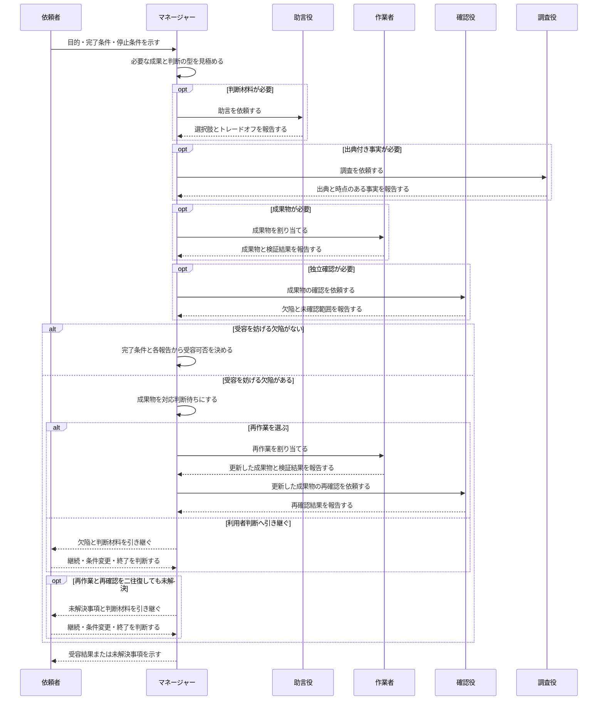
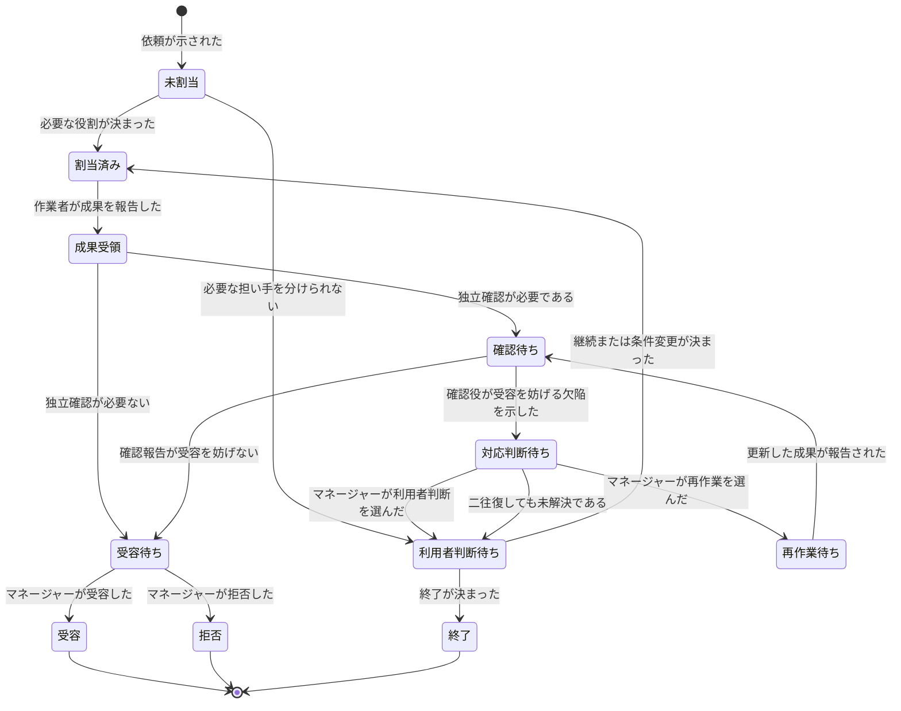

# エージェント役割割当の業務知識と振る舞い

> 型: コアドメインの業務知識 ／ 読み手: 複数エージェントへ仕事を割り当てる人、役割定義を保守する人、成果物を確認する人

## この資料の目的

**役割割当の目的は、依頼に必要な成果の種類から責任を分け、誰が作り、誰が反証し、誰が最終的に受容するかを曖昧にしないことである。**

この資料は、依頼を受けてから必要な役割を選び、成果物と報告を受け取り、マネージャーが受容可否を決めるまでを扱う。エージェントの起動、タスク配送、モデル選択、実行場所、画面配置は扱わない。

根拠は[役割割当Skill](../plugins/agent-roles/SKILL.md#必要なroleだけを割り当てる)、[役割一覧](../plugins/agent-roles/roles/catalog.yml)、[Fleetとの所有境界](2026-08-30-agent-fleet-design.md#所有境界)である。

## ユビキタス言語

| 用語 | この資料での意味 | 含めないもの |
|---|---|---|
| 依頼 | 目的、完了条件、停止条件と必要な成果が示された仕事 | 実行場所や画面配置 |
| 役割 | 一定の目的、責任、権限、禁止事項と成果物の型を持つ仕事上の立場 | エージェント個体、モデル、タスク、Pane |
| 役割割当 | 依頼に必要な役割と、その役割を担う者を決めること | エージェントの起動や指示配送 |
| 成果物 | 作業者が依頼の完了条件に向けて作るものと検証結果 | 作業者自身による合格判定 |
| 助言 | 選択肢、トレードオフ、前提の穴を示す判断材料 | 成果物の合否判定や修正 |
| 独立確認 | 作業経緯から独立した確認役が、再現可能な欠陥と未確認範囲を示すこと | 作業者または助言者による自己確認 |
| 調査事実 | 出典と時点を伴い、推奨を含まない事実 | 推奨案や成果物の合否 |
| 受容 | マネージャーが完了条件と報告を根拠に、成果物を依頼の結果として認めること | 作業者の完了報告そのもの |
| 越境 | ある役割が、別の役割にだけ認められた判断や作業を行うこと | 明示された受け渡し |

役割一覧にある識別子と、この資料の呼び方は次のとおり対応する。

| 役割識別子 | この資料での呼び方 |
|---|---|
| `manager` | マネージャー |
| `advisor` | 助言役 |
| `worker` | 作業者 |
| `reviewer` | 確認役 |
| `researcher` | 調査役 |

## 業務ルール

### 必要な役割だけを割り当てる

**役割は作業手順ではなく、依頼に必要な成果物と判断の型から選ぶ。** 全役割を常に割り当てない。

- 最終判断と受容が必要ならマネージャーが担う。
- 選択肢とトレードオフが必要なら助言役が担う。
- 成果物の作成が必要なら作業者が担う。
- 作業経緯から独立した反証が必要なら確認役が担う。
- 出典と時点のある事実が必要なら調査役が担う。

### 役割を兼任させない

**必要な役割の担い手がいないことを、別の役割への暗黙の兼任で埋めない。**

- 助言した本人は、その助言が反映された成果物の確認役にならない。
- 成果物を作った本人は、その成果物の確認役にならない。
- 独立確認が必要なのに別の担い手を用意できない場合、その範囲は未確認のまま残す。

### 各役割は成果の型を越えない

**各役割は、自分に割り当てられた成果の型と権限を越えない。**

| 役割 | 返すもの | 行わないこと |
|---|---|---|
| マネージャー | 役割割当、受容または拒否の判断 | 作業者の成果物の実装 |
| 助言役 | 選択肢とトレードオフ | 合否判定、実装、修正、自分の助言の確認 |
| 作業者 | 成果物、検証結果、未確認範囲 | 完了条件の変更、自己受容、依頼外の改善 |
| 確認役 | 再現可能な欠陥、未確認範囲、取り下げた指摘 | 修正、作業途中の助言、好みによる採点 |
| 調査役 | 出典と時点のある事実、不明点、未調査範囲 | 推奨、実装、出典のない断定 |

### マネージャーが受容可否を決める

**作業者の成果報告は受容の材料であり、受容そのものではない。** マネージャーは依頼の完了条件、成果物と検証結果、必要な独立確認の報告を根拠に受容または拒否を決める。確認役が受容を妨げる欠陥を示している間は受容しない。

### 受容を妨げる報告を解消してから再判断する

**確認役が受容を妨げる欠陥を報告した成果物は対応判断待ちとし、再作業または利用者判断を経ずに受容しない。** マネージャーは対応判断待ちの成果物について、欠陥を作業者へ戻して再作業を割り当てるか、通常の役割分担では決められない価値判断として利用者へ引き継ぐ。再作業後の成果物は確認役が再び独立確認し、欠陥が解消されたときだけ受容待ちへ戻す。

### 二往復で未解決なら利用者判断へ上げる

**同じ未解決事項について、再作業と再確認を二往復しても受容を妨げる欠陥が残る場合、通常の再作業を続けない。** マネージャーは未解決の状態と判断材料を保ったまま利用者判断へ引き継ぐ。これは作業を諦めるためではなく、同じやり取りを無期限に繰り返さず、完了条件や受容可能なリスクを決められる人へ判断を戻すためである。

### 同じ割当と報告を二重に数えない

**終了していない同一の役割割当を再度行っても割当は一件のままとし、同一の成果報告が再送されても受領は一件として扱う。** 再送によって担当数、報告数、再作業の往復数、受容可否が変わってはならない。内容が更新された成果物は新しい報告として区別する。

## アクターと協働

| 役割 | 目的 | 判断または提供責任 | 主な受け渡し |
|---|---|---|---|
| 依頼者 | 必要な結果を得る | 目的、完了条件、停止条件を示す | 依頼をマネージャーへ渡す |
| マネージャー | 依頼全体を完了条件へ到達させる | 必要な役割、担当、受容可否を決める | 割当を各役割へ渡し、報告を受け取る |
| 助言役 | 判断材料を増やす | 選択肢と捨てるものを示す | 助言をマネージャーへ渡す |
| 作業者 | 割り当てられた成果を作る | 成果物、検証結果、未確認範囲を示す | 成果報告をマネージャーへ渡す |
| 確認役 | 成果物を独立に反証する | 再現可能な欠陥と未確認範囲を示す | 確認報告をマネージャーへ渡す |
| 調査役 | 判断に必要な事実を明らかにする | 出典と時点を伴う事実を示す | 調査報告をマネージャーへ渡す |



## 振る舞い断面

| 断面 | 事前状態 | 起きたこと | 判断 | 結果と次状態 |
|---|---|---|---|---|
| 役割を選ぶ | 依頼の目的、完了条件、停止条件が決まっている | マネージャーが必要な役割を決める | 成果と判断の型ごとに必要性を判定する | 必要な役割だけが割当済みになる |
| 兼任を拒む | 独立確認が必要だが別の担い手がいない | マネージャーが役割を決める | 独立性を満たすか判定する | 暗黙の兼任は成立せず、未確認範囲が残る |
| 成果を報告する | 作業者が成果物を作成した | 成果物と検証結果が報告された | 受容判断の材料として扱う | 成果受領となるが、受容済みにはならない |
| 独立に確認する | 成果物が報告され、独立確認が必要である | 確認役が反証結果を報告した | 受容を妨げる欠陥があるかを示す | 受容待ちまたは対応判断待ちになる |
| 再作業を割り当てる | 成果物が対応判断待ちである | マネージャーが再作業を割り当てる | 報告された欠陥を解消できるか判定する | 成果物が再作業待ちになる |
| 更新成果を受け取る | 成果物が再作業待ちである | 作業者が更新した成果物を報告する | 独立確認を再び必要とするか判定する | 成果物が確認待ちになる |
| 利用者判断へ引き継ぐ | 成果物が対応判断待ちであり、通常の役割分担では決められない | マネージャーが欠陥と判断材料を引き継ぐ | 継続、条件変更、終了のどれを選ぶか利用者が判断する | 判断に従って再開または終了する |
| 二往復で打ち切る | 同じ未解決事項を二往復しても欠陥が残っている | マネージャーが通常の再作業を打ち切る | 通常のやり取りの上限へ達したか判定する | 未解決事項が利用者判断待ちになる |
| 重複を扱う | 終了していない同じ割当または受領済みの同じ報告がある | 同じ割当または報告が再び届く | 同一性を判定する | 件数と状態を変えず、既存の事実を保つ |
| 受容を決める | 必要な成果報告と確認報告が揃っている | マネージャーが受容可否を判断する | 完了条件と報告を照合する | 受容または拒否になる |

## 状態と業務イベント



役割割当が決まると、各役割は自分に定められた成果だけを返せる。成果報告が届いても、マネージャーの判断までは受容済みにならない。必要な独立確認が成立しない場合は、未確認範囲を隠さず次の判断へ引き継ぐ。

## BDD

```gherkin
Feature: エージェント役割割当

Scenario: 成果物と独立確認に必要な役割を分けて割り当てる
  Given 依頼の目的が決まっている
  And 依頼の完了条件が決まっている
  And 依頼の停止条件が決まっている
  And 依頼には成果物の作成が必要である
  And 依頼には成果物から独立した確認が必要である
  And 依頼には選択肢とトレードオフが必要ない
  And 依頼には出典と時点のある事実が必要ない
  And 作業者と確認役を別の担い手へ割り当てられる
  When マネージャーが依頼に必要な役割を決める
  Then 作業者と確認役が別の担い手へ割り当てられる
  And 助言役と調査役は割り当てられない
```

```gherkin
Scenario: 判断材料だけが必要な依頼には助言役だけを加える
  Given 依頼の目的が決まっている
  And 依頼の完了条件が決まっている
  And 依頼の停止条件が決まっている
  And 依頼には選択肢とトレードオフが必要である
  And 依頼には成果物の作成が必要ない
  And 依頼には独立確認が必要ない
  And 依頼には出典と時点のある事実が必要ない
  When マネージャーが依頼に必要な役割を決める
  Then 助言役が割り当てられる
  And 作業者と確認役は割り当てられない
  And 調査役は割り当てられない
```

```gherkin
Scenario: 出典付き事実だけが必要な依頼には調査役を割り当てる
  Given 依頼の目的が決まっている
  And 依頼の完了条件が決まっている
  And 依頼の停止条件が決まっている
  And 依頼には出典と時点のある事実が必要である
  And 依頼には選択肢とトレードオフが必要ない
  And 依頼には成果物の作成が必要ない
  And 依頼には独立確認が必要ない
  When マネージャーが依頼に必要な役割を決める
  Then 調査役が割り当てられる
  And 助言役と作業者は割り当てられない
  And 確認役は割り当てられない
```

```gherkin
Scenario: 必要な役割の担い手がいないときは暗黙に兼任させない
  Given 依頼の目的が決まっている
  And 依頼の完了条件が決まっている
  And 依頼の停止条件が決まっている
  And 依頼には成果物の作成が必要である
  And 依頼には成果物から独立した確認が必要である
  And 作業者と確認役を別の担い手へ割り当てられない
  When マネージャーが依頼に必要な役割を決める
  Then 作業者と確認役の暗黙の兼任は成立しない
  And 独立確認できない範囲が未確認として残る
NOTE:
  Rule: 役割を兼任させない
  Reason: 必要な作業者と確認役を別の担い手へ割り当てられず、独立性を満たさないため
```

```gherkin
Scenario: 助言した本人を同じ成果の確認役にしない
  Given 依頼の目的が決まっている
  And 依頼の完了条件が決まっている
  And 依頼の停止条件が決まっている
  And 対象の成果物には独立確認が必要である
  And 助言した担い手と確認役の担い手が同じである
  When マネージャーが助言済みの成果物へ確認役を割り当てる
  Then その確認役の割当は成立しない
  And 対象の成果物は独立確認済みにならない
NOTE:
  Rule: 役割を兼任させない
  Reason: 自分の助言を自分で独立確認する割当になるため
```

```gherkin
Scenario: 成果物を作った本人を同じ成果の確認役にしない
  Given 依頼の目的が決まっている
  And 依頼の完了条件が決まっている
  And 依頼の停止条件が決まっている
  And 対象の成果物には独立確認が必要である
  And 成果物を作った担い手と確認役の担い手が同じである
  When マネージャーが作業済みの成果物へ確認役を割り当てる
  Then その確認役の割当は成立しない
  And 対象の成果物は独立確認済みにならない
NOTE:
  Rule: 役割を兼任させない
  Reason: 自分が作った成果物を自分で独立確認する割当になるため
```

```gherkin
Scenario: 作業者の成果報告を受領して受容待ちにする
  Given 依頼の目的が決まっている
  And 依頼の完了条件が決まっている
  And 依頼の停止条件が決まっている
  And 作業者は割り当てられた成果物を作成している
  And 依頼には独立確認が必要ない
  And マネージャーは成果物をまだ受容していない
  When 作業者から成果物と検証結果が報告された
  Then 成果物は受領済みになる
  And 成果物は受容待ちになる
```

```gherkin
Scenario: 独立確認を通った成果物をマネージャーが受容する
  Given 依頼の目的が決まっている
  And 依頼の完了条件が決まっている
  And 依頼の停止条件が決まっている
  And 作業者から成果物と検証結果が報告されている
  And 独立確認が必要な成果物について確認役の報告がある
  And 確認役の報告によって受容が妨げられていない
  And 成果物が依頼の完了条件を満たしている
  When マネージャーが成果物の受容可否を判断する
  Then 成果物は受容済みになる
```

```gherkin
Scenario: 必要な独立確認より先に成果物を受容しない
  Given 作業者から成果物と検証結果が報告されている
  And 対象の成果物には独立確認が必要である
  And 確認役の報告がまだない
  When マネージャーが成果物を受容しようとする
  Then 成果物は受容済みにならない
  And 成果物は確認待ちのままになる
NOTE:
  Rule: マネージャーが受容可否を決める
  Reason: 必要な独立確認の報告がなく、受容を判断する材料が揃っていないため
```

```gherkin
Scenario: 受容を妨げる欠陥がある成果物を受容しない
  Given 作業者から成果物と検証結果が報告されている
  And 確認役から独立確認の報告がある
  And 成果物は対応判断待ちである
  And 確認役が受容を妨げる再現可能な欠陥を報告している
  When マネージャーが成果物を受容しようとする
  Then 成果物は受容済みにならない
  And 成果物は対応判断待ちのままになる
NOTE:
  Rule: 受容を妨げる報告を解消してから再判断する
  Reason: 受容を妨げる欠陥が未解決であり、再作業か利用者判断が必要なため
```

```gherkin
Scenario: 二往復で未解決のやり取りを通常継続しない
  Given 同じ未解決事項について再作業と再確認を二往復している
  And 成果物は対応判断待ちである
  And 確認役が受容を妨げる欠陥を取り下げていない
  When マネージャーが同じ未解決事項について通常の再作業を続けようとする
  Then 通常の再作業は追加されない
  And 未解決事項と判断材料が利用者判断へ引き継がれる
  And 成果物は利用者判断待ちになる
NOTE:
  Rule: 二往復で未解決なら利用者判断へ上げる
  Reason: 通常のやり取りの上限へ達しても未解決であり、利用者判断へ引き継ぐ必要があるため
```

```gherkin
Scenario: 作業者は成果物を受容済みにできない
  Given 作業者から成果物と検証結果が報告されている
  And 作業者は受容権限を持たない
  When 作業者が自分の成果物を受容済みにしようとする
  Then 成果物は受容済みにならない
  And 成果物はマネージャーの受容待ちのままになる
NOTE:
  Rule: マネージャーが受容可否を決める
  Reason: 作業者には成果物を受容済みにする権限がないため
```

```gherkin
Scenario: 同じ役割割当を二重に数えない
  Given 対象の依頼には同じ担い手への同じ役割割当がある
  And 既存の役割割当は終了していない
  When マネージャーが同じ役割割当を再び行う
  Then 対象の役割割当は一件のままになる
  And 担当する役割の数は増えない
```

```gherkin
Scenario: 同じ成果報告を二重に数えない
  Given 対象の成果報告はすでに受領されている
  And 既存の成果報告は取り下げられていない
  When 同じ作業者から同じ成果報告が再び届いた
  Then 対象の成果報告は一件のままになる
  And 再作業の往復数は増えない
```

## この資料に書かないもの

- エージェント個体の起動、停止、再起動
- タスクの配送、進捗監視、再試行
- モデル、実行環境、端末、Pane、画面比率
- 役割定義を保存・検査するファイル形式
- Fleet全体の状態、通信、永続化、Hook

これらは役割割当の判断ではなく、Fleetまたは実装設計の責務である。

## 未回答の問い

なし。現行の役割一覧と役割割当Skillで、今回扱う役割選定、兼任禁止、成果の受け渡し、受容責任を判断できる。
